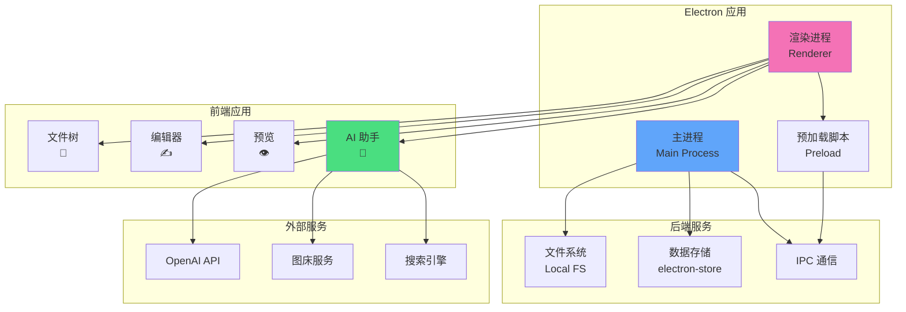
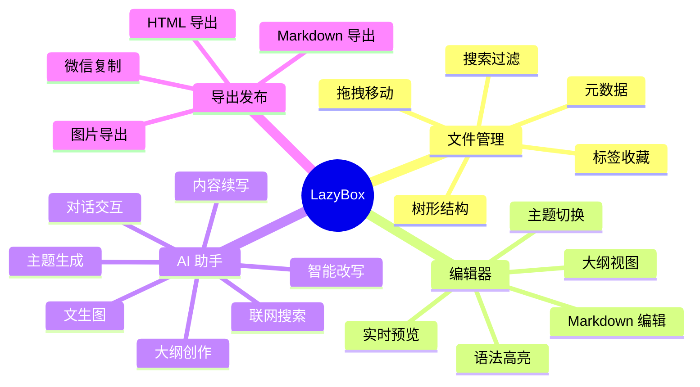
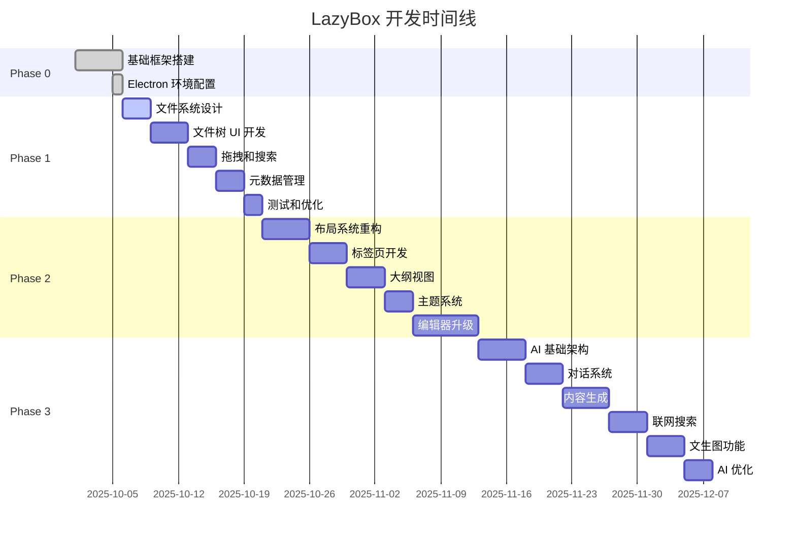
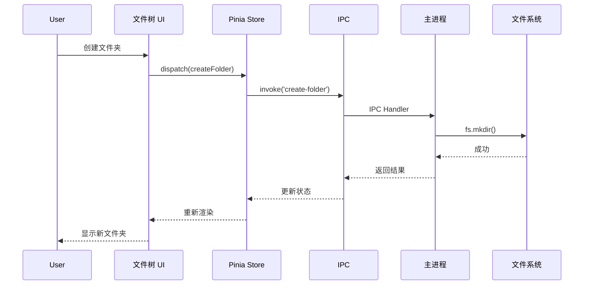
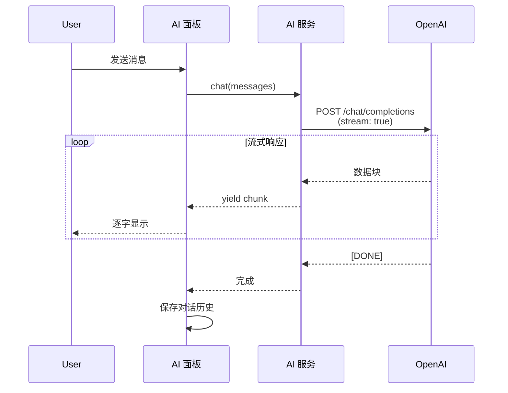
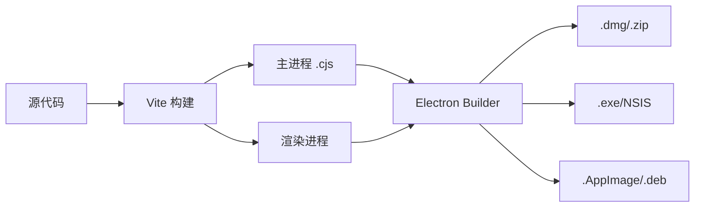

# LazyBox 架构设计

## 系统架构



---

## 功能模块规划



---

## 开发阶段流程



---

## 数据流向

### 文件管理数据流



### AI 对话数据流



---

## 技术架构

### 主进程 (Main Process)

```typescript
// src/main/index.ts - 应用入口
// src/main/ipc.ts - IPC 通信处理
// src/main/menu.ts - 应用菜单
// src/main/store.ts - 数据持久化
// src/main/local.ts - 文件系统操作
// src/main/ai.ts - AI 服务管理 (新增)
```

### 渲染进程 (Renderer)

```typescript
// 核心模块
src/renderer/src/
├── stores/              // 状态管理
│   ├── fileSystem.ts   // 文件系统状态 (新增)
│   ├── editor.ts       // 编辑器状态
│   └── ai.ts          // AI 助手状态 (新增)
├── components/
│   ├── FileTree/       // 文件树组件 (新增)
│   ├── Editor/         // 编辑器组件
│   ├── Preview/        // 预览组件
│   └── AI/            // AI 面板组件 (新增)
├── services/
│   ├── fileService.ts  // 文件操作服务
│   ├── aiService.ts    // AI 服务抽象 (新增)
│   └── searchService.ts // 搜索服务 (新增)
└── utils/
    ├── markdown.ts     // Markdown 处理
    └── storage.ts      // 本地存储
```

---

## 关键技术决策

### 1. 文件系统管理

**选择：** 自定义文件树结构 + chokidar 监听

**理由：**
- 灵活控制树形结构
- 实时监听文件变化
- 支持元数据扩展

**替代方案：**
- ~~直接使用操作系统文件浏览器~~ (无法自定义)
- ~~Electron 原生对话框~~ (用户体验差)

### 2. 编辑器选择

**当前：** CodeMirror 5

**未来计划：** CodeMirror 6 或 Monaco Editor

**对比：**

| 特性 | CodeMirror 5 | CodeMirror 6 | Monaco |
|------|-------------|--------------|---------|
| 性能 | 中 | 高 | 高 |
| 扩展性 | 一般 | 优秀 | 优秀 |
| 体积 | 小 | 中 | 大 |
| TypeScript | 支持 | 原生支持 | 原生支持 |
| LSP | 困难 | 容易 | 内置 |

**决策：** 先保持 CodeMirror 5，待 v0.3.0 再升级

### 3. AI 服务架构

**选择：** 抽象层 + 多提供商支持

```typescript
// 统一接口
interface AIProvider {
  chat(messages: Message[]): Promise<string>
  stream(messages: Message[]): AsyncIterator<string>
}

// 支持多种实现
class OpenAIProvider implements AIProvider { }
class ClaudeProvider implements AIProvider { }
class LocalModelProvider implements AIProvider { }
```

**优势：**
- 易于切换 AI 提供商
- 支持本地大模型
- 统一的错误处理

### 4. 状态管理

**选择：** Pinia

**理由：**
- Vue 3 官方推荐
- TypeScript 友好
- 模块化设计
- 轻量级

**状态结构：**

```typescript
// fileSystemStore
interface FileSystemState {
  rootNodes: FileNode[]
  currentFile: FileNode | null
  selectedFiles: FileNode[]
  searchQuery: string
}

// aiStore
interface AIState {
  conversations: Conversation[]
  currentConversation: Conversation | null
  isGenerating: boolean
  settings: AISettings
}
```

---

## 性能优化策略

### 1. 大文件处理
- 虚拟滚动（只渲染可见区域）
- 分块加载（按需加载文件内容）
- Web Worker 处理（避免阻塞主线程）

### 2. AI 流式响应
- Server-Sent Events (SSE)
- 逐字渲染动画
- 取消请求支持

### 3. 文件树优化
- 懒加载子节点
- 虚拟列表（大量文件时）
- 节流和防抖

---

## 安全考虑

### 1. API Key 管理
- 使用 `safeStorage` 加密存储
- 不在日志中输出
- 支持环境变量配置

### 2. 文件访问权限
- 沙箱隔离
- 路径验证（防止目录遍历）
- 用户确认敏感操作

### 3. AI 内容审核
- 内容过滤
- 敏感词检测
- 用户可自定义规则

---

## 测试策略

### 单元测试
- 工具函数测试
- Store 逻辑测试
- 组件测试

### 集成测试
- IPC 通信测试
- 文件操作测试
- AI 服务测试

### E2E 测试
- 用户流程测试
- 跨平台测试
- 性能测试

---

## 部署架构

### 打包流程



### 更新机制
- 使用 `electron-updater`
- 增量更新支持
- 版本检查
- 自动下载安装

---

最后更新：2025-10-06
