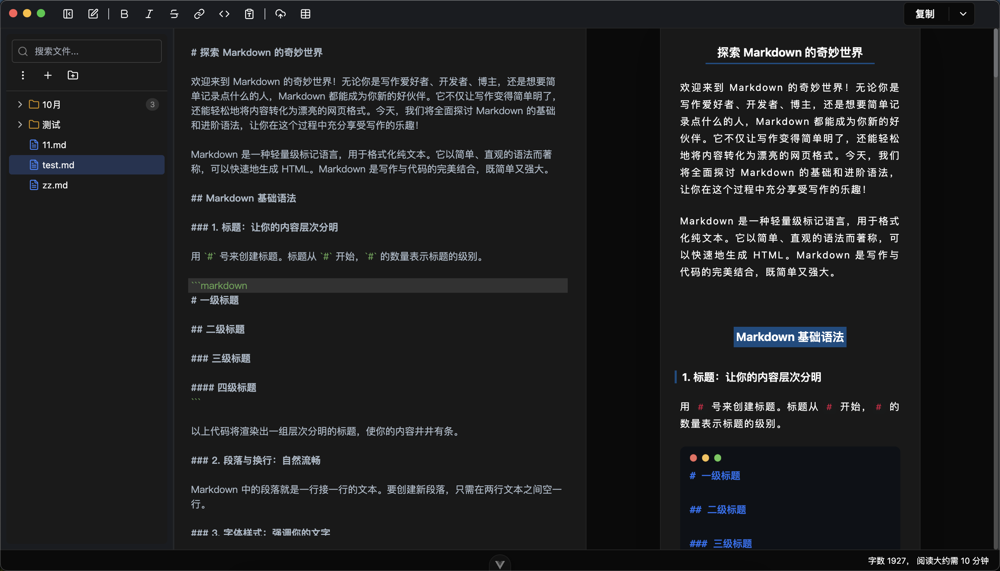
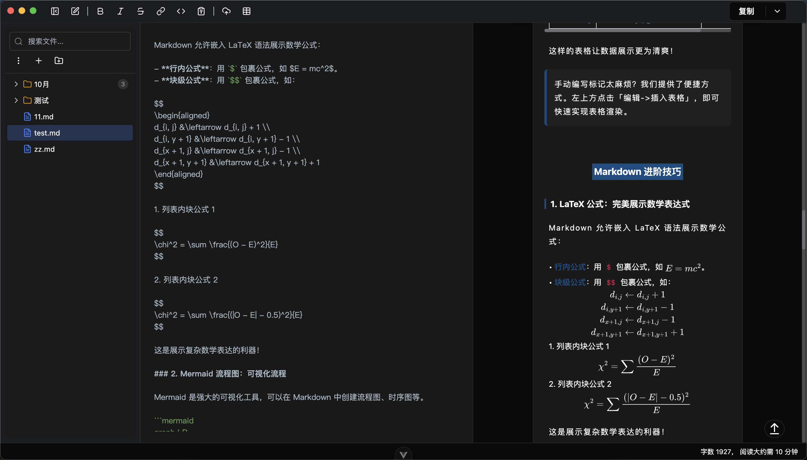

# LazyBox

<div align="center">
  
  <p>基于 doocs/md 开发的微信 Markdown 编辑器桌面应用</p>
  <p>
    <a href="https://github.com/melonlee/LazyBox/releases">下载</a> •
    <a href="#快速开始">快速开始</a> •
    <a href="./ROADMAP.md">开发路线图</a> •
    <a href="./WORKSPACE_USAGE.md">使用文档</a>
  </p>
</div>

---

## ✨ 特性

- 📝 **Markdown 编辑器** - 实时预览，所见即所得
- 🎨 **微信公众号样式** - 专为微信公众号排版优化
- 💾 **本地存储** - 文章自动保存到本地
- 📤 **多种导出** - 支持导出 Markdown、HTML 格式
- 🌈 **主题定制** - 支持自定义 CSS 样式
- 🖼️ **图片上传** - 支持多种图床服务
- 📁 **文件管理** - 树形文件夹，支持拖拽和搜索
- ⚡ **快速启动** - Electron + Vite 极速开发体验

## 📸 产品截图

<div align="center">
  
  <p><em>欢迎界面 - 优雅的工作空间管理</em></p>
</div>

<br>

<div align="center">
  
  <p><em>主编辑界面 - 实时预览与自定义样式</em></p>
</div>

<br>

<div align="center">
  
  <p><em>丰富的编辑功能与主题定制</em></p>
</div>

## 🚀 快速开始

### 1. 克隆项目

```bash
git clone https://github.com/melonlee/LazyBox.git
cd LazyBox
```

### 2. 安装依赖

```bash
# 使用 pnpm（推荐）
pnpm install

# 或使用 npm
npm install
```

**注意**：项目已配置国内镜像源（`.npmrc`），首次安装 Electron 需要下载约 90MB 文件。

### 3. 启动开发服务器

```bash
pnpm dev
```

应用会自动打开 Electron 窗口。

## 📦 构建打包

```bash
# 构建应用（不打包）
pnpm build

# 打包为安装包
pnpm build:mac    # macOS
pnpm build:win    # Windows
pnpm build:linux  # Linux
```

## 🛠️ 技术栈

- **Electron** `28.1.0` - 跨平台桌面应用
- **Vue** `3.5+` - 渐进式前端框架
- **Vite** `4.5+` - 下一代构建工具
- **TypeScript** `5.7+` - 类型安全
- **CodeMirror** - 代码编辑器
- **TailwindCSS / UnoCSS** - CSS 框架

## 🗺️ 开发路线图

查看 **[ROADMAP.md](./ROADMAP.md)** 了解完整计划。

### 近期计划

#### Phase 1: 文件管理增强 (v0.2.0) ✅
- ✅ 树形文件夹结构
- ✅ 文件拖拽和移动
- ✅ 文件搜索功能

#### Phase 2: 编辑器布局重构 (v0.3.0) 🚧
- 🚧 工作区模式系统（编辑/阅读/管理/图谱/专注）
- 🚧 灵活的侧边面板
- 🚧 多文件标签页
- 🚧 知识图谱可视化

#### Phase 3: AI 写作助手 (v0.4.0) 📋
- 📋 AI 对话助手
- 📋 主题和大纲生成
- 📋 内容续写和改写
- 📋 联网搜索
- 📋 AI 生成配图

## 📖 文档

- **[使用文档](./WORKSPACE_USAGE.md)** - 详细的使用说明
- **[开发路线图](./ROADMAP.md)** - 功能规划和进度
- **[架构设计](./ARCHITECTURE.md)** - 技术架构说明
- **[更新日志](./CHANGELOG_v0.2.0.md)** - 版本更新记录

## ❓ 常见问题

### Electron 安装失败？

项目已配置淘宝镜像源，如仍失败：

```bash
# 删除依赖重新安装
rm -rf node_modules pnpm-lock.yaml
pnpm install
```

详细故障排除请查看 [WORKSPACE_USAGE.md](./WORKSPACE_USAGE.md)。

### 如何调试？

- **渲染进程**：按 `Cmd+Option+I` (macOS) 或 `Ctrl+Shift+I` (Windows) 打开开发者工具
- **主进程**：终端输出日志

## 🤝 贡献

欢迎提交 Issue 和 Pull Request！

## 📄 许可证

[MIT License](./LICENSE)

## 🙏 致谢

本项目基于以下优秀开源项目：

- [doocs/md](https://github.com/doocs/md) - 微信 Markdown 编辑器
- [electron-vite](https://github.com/alex8088/electron-vite) - Electron + Vite 开发工具

---

<div align="center">
  Made with ❤️ by <a href="https://github.com/melonlee">@melonlee</a>
</div>
